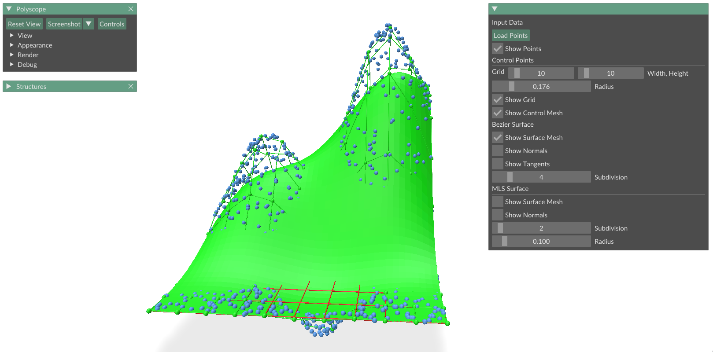
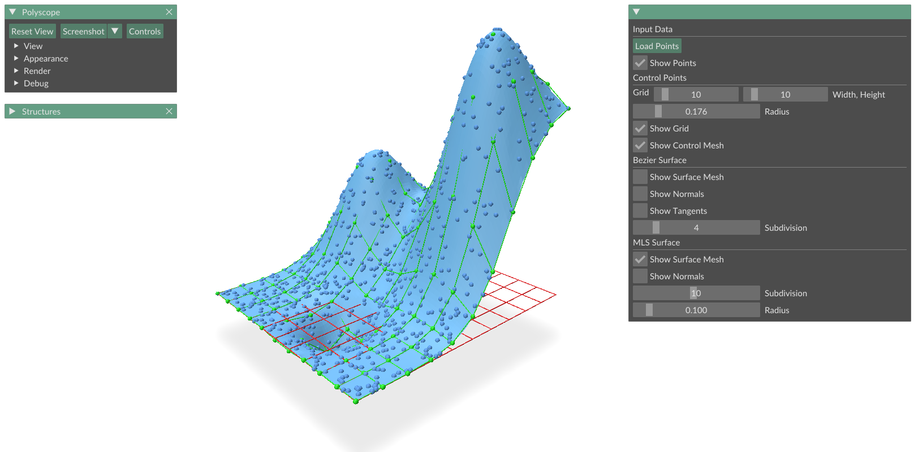
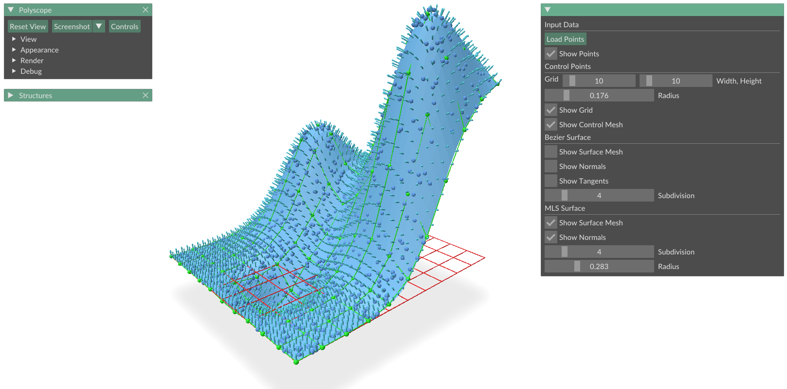
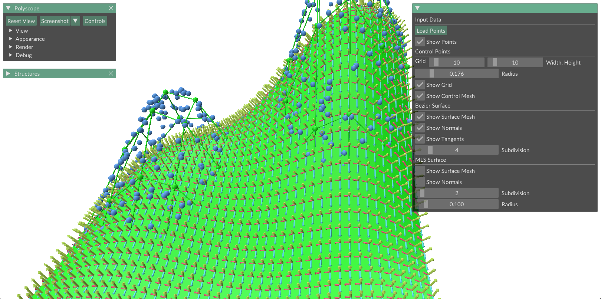
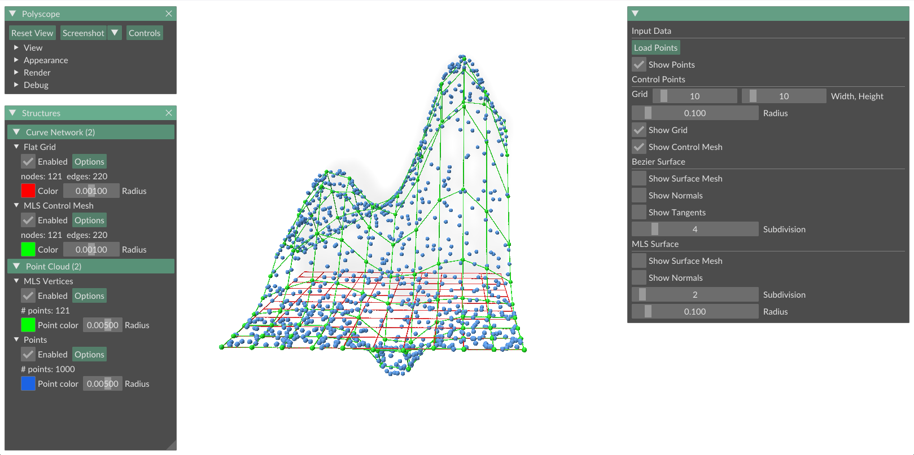

# Surface Approximation with Bézier Patches and Moving Least Squares

**C++17 · Geometry Processing · Surface Reconstruction · KD-tree · Polyscope**

An interactive C++ application for reconstructing and visualizing smooth height-field surfaces from scattered 3D points. The project implements two complementary approximation pipelines: **tensor-product Bézier surfaces** and **Moving Least Squares (MLS)**. It provides interactive controls for fitting radius, grid resolution, subdivision level, and surface visualization.

Developed as part of **Computer Graphics 2** at **Technische Universität Berlin**.

## Gallery

### Bézier Surface


### Moving Least Squares Surface


### MLS Normal Visualization


### Bézier Tangents and Normals


### Input Point Cloud and Control Grid


## Features

- **Point-cloud input:** Load `.off` point sets and visualize them in 3D.
- **Spatial queries:** Custom **KD-tree** implementation with radius and k-nearest-neighbor queries.
- **Local surface fitting:** Quadratic **weighted least squares** using a compactly supported **Wendland** weight function.
- **Bézier surface reconstruction:** Build a control grid from local fits and evaluate a tensor-product Bézier surface using the **de Casteljau algorithm**.
- **Bézier differential quantities:** Compute tangents during evaluation and estimate surface normals from tangent cross products.
- **MLS surface reconstruction:** Evaluate local quadratic fits on a denser grid to generate a polygonal height-field surface.
- **MLS normal approximation:** Estimate normals from the derivatives of the locally fitted polynomials.
- **Interactive visualization:** Toggle points, control meshes, surfaces, tangents, and normals using **Polyscope** and **ImGui** controls.

## Algorithms

### Weighted Least Squares

At each query position `(x, y)`, neighboring samples are collected within a user-defined radius in the XY plane. A local quadratic polynomial is fitted:

```math
z(x,y) = a_0 + a_1 x + a_2 y + a_3 x^2 + a_4 xy + a_5 y^2
```

using a compactly supported Wendland weight:

```math
w(q) = (1-q)^4(4q+1), \quad 0 \le q \le 1
```

with zero weight outside the support, where `q` is the normalized XY distance.

### Tensor-product Bézier Surface

A lower-resolution fitted grid is used as the Bézier control net. The surface is evaluated using the **1D de Casteljau algorithm** first in one parameter direction and then in the other. Tangent vectors are computed during evaluation, and normals are estimated from their cross product.

### Moving Least Squares Surface

For the MLS result, the application creates a denser grid and fits a new local quadratic polynomial at every grid vertex. The resulting heights are assembled into a quad mesh. Normals are approximated from the local polynomial derivatives.

> **Note:** The implementation treats the surfaces as **height fields** `z = f(x, y)`. It is therefore intended for surfaces that can be represented over a planar XY domain.

## Tech Stack

| Technology | Purpose |
| --- | --- |
| C++17 | Core implementation |
| Eigen 3.4.0 | Linear algebra and least-squares solves |
| Polyscope 2.4.0 | 3D visualization |
| ImGui (via Polyscope) | Interactive GUI controls |
| portable-file-dialogs 0.1.0 | File selection |
| CMake 3.14+ | Build system |

Third-party libraries are retrieved via **CMake FetchContent** during configuration.

## Build

### Prerequisites

- C++17-compatible compiler
- CMake 3.14+
- Git
- OpenGL / windowing dependencies required by Polyscope

### Ubuntu / Debian

```bash
sudo apt update
sudo apt install build-essential cmake git xorg-dev libglu1-mesa-dev freeglut3-dev mesa-common-dev
```

### Windows

Install:

- **Visual Studio 2022** with **Desktop development with C++**
- **CMake**
- **Git**

### Build Commands

Clone the repository:

```bash
git clone https://github.com/KavehSn79/bezier-mls-surface-reconstruction.git
cd bezier-mls-surface-reconstruction
```

Configure and build:

```bash
cmake -S . -B build -DCMAKE_BUILD_TYPE=Release
cmake --build build --config Release --parallel
```

The executable target is named **`surface_reconstruction`**.

### Run the Application

**Windows (Visual Studio):**

```powershell
.\build\bin\Release\surface_reconstruction.exe
```

**Linux:**

```bash
./build/bin/surface_reconstruction
```

## Usage

1. Launch the compiled executable.
2. Click **Load Points** and select an `.off` point cloud.
3. Adjust the control grid **Width**, **Height**, and fitting **Radius**.
4. Enable **Show Control Mesh** to generate the fitted control points.
5. Toggle **Bézier Surface** and adjust its **Subdivision**.
6. Toggle **MLS Surface** and adjust its subdivision and support radius.
7. Enable **Show Normals** or **Show Tangents** as needed.

## Project Structure

```text
.
├── main.cpp                         # Application entry point and UI workflow
├── surface/
│   ├── surface.h
│   └── surface.cpp                  # WLS, Bézier, MLS, normals, tangents
├── spatial/
│   ├── geometry.h
│   ├── spatial_data_structure.h
│   └── spatial_data_structure.cpp   # KD-tree and neighborhood queries
├── visualization/
│   ├── visuals.h
│   └── visuals.cpp                  # Visualization helpers
├── benchmark/                       # Spatial-query utilities
├── pointdata/pointdata/             # Example OFF datasets
├── docs/images/                     # Result screenshots
├── CMakeLists.txt
└── README.md
```

## Implementation Notes

- The quadratic basis has **six coefficients**, so fitting requires enough nearby samples.
- Distances for the weighting function are computed in the **XY domain**, matching the height-field formulation.
- The interactive workflow uses **local weighted fitting**, while some utility functions also support ordinary least squares.
- MLS normals are approximated using local polynomial derivatives rather than the exact derivatives of the moving MLS surface.
- The repository builds on a course-provided C++ / Polyscope scaffold, with the project-specific approximation and visualization logic implemented in the source files above.

## Acknowledgments

Developed for **Computer Graphics 2** at **TU Berlin** under **Prof. Dr. Marc Alexa**.

The project uses [Polyscope](https://polyscope.run/) for interactive 3D visualization and [Eigen](https://eigen.tuxfamily.org/) for linear algebra.
